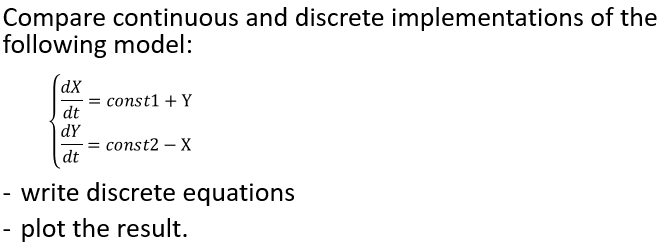
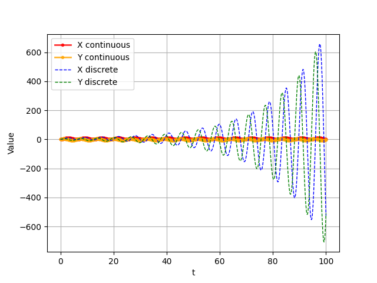
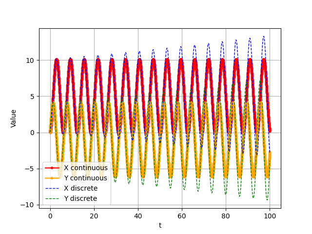

## ЛР 0

Чернышова Дана Кирилловна

1) Task description:




2) Solution method (possible with code)
```python
from pylab import *
from scipy.integrate import odeint
from numpy import linspace

N = 100
step = 1 / 10
t = linspace(0, N, int(N / step))
const1 = 1
const2 = 5


# continuous
def model(v, _):
	X, Y = v
	return [const1 + Y, const2 - X]


v = odeint(model, (0, 0), t)
X_cont = [row[0] for row in v]
Y_cont = [row[1] for row in v]
plot(t, X_cont, ".-", lw=2, color="red", alpha=0.8, label="X continuous")
plot(t, Y_cont, ".-", lw=2, color="orange", alpha=0.8, label="Y continuous")

# discrete
X_disc = [0]
Y_disc = [0]
for i in range(len(t) - 1):
	X_next = X_disc[-1] + (const1 + Y_disc[-1]) * step
	Y_next = Y_disc[-1] + (const2 - X_disc[-1]) * step
	X_disc.append(X_next)
	Y_disc.append(Y_next)

plot(t, X_disc, "--", lw=1, color="blue", label="X discrete")
plot(t, Y_disc, "--", lw=1, color="green", label="Y discrete")

xlabel("t")
ylabel("Value")
legend()
grid(True)
show()
```

3) Results

Descrete equations:

X(n+1) = Xn + (const1 + Yn) * step

Y(n+1) = Yn + (const2 - Xn) * step

_Picture 1. Step = 1/10_



_Picture 2. Step = 1/100_



4) Conclusions

The discrete solution approximates the continuous system using Forward Euler method.
It assumes the derivatives are constant over a very small time interval (step). 
