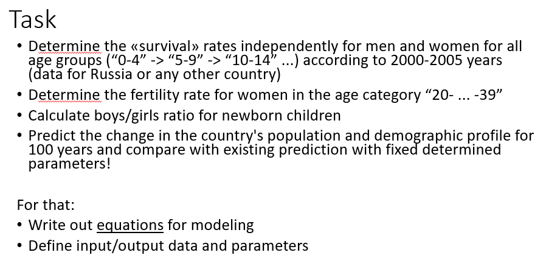
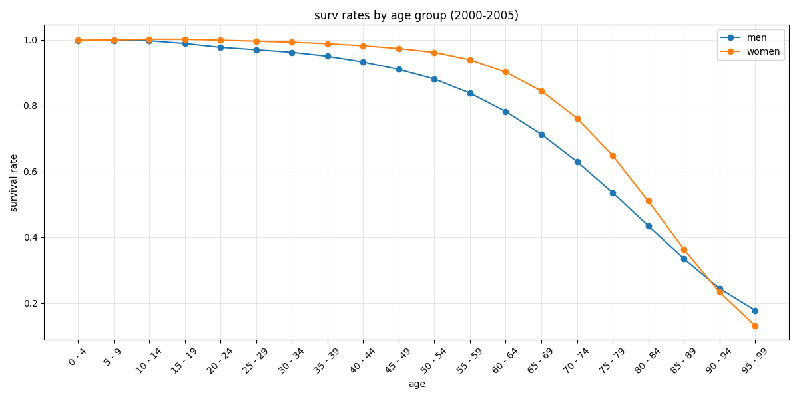

## ЛР 2

Чернышова Дана Кирилловна


1) Task description



2) Solution method (possible with code)

Survival Rates by Age Group (2000-2005)
```python
import pandas as pd
import matplotlib.pyplot as plt

male_data = pd.read_excel('age_data_2005.xls', header=5, sheet_name=3)
female_data = pd.read_excel('age_data_2005.xls', header=5, sheet_name=6)

male_russia = male_data[male_data['Country code'] == 643]
female_russia = female_data[female_data['Country code'] == 643]

# years
male_2000 = male_russia[male_russia['Reference date (as of 1 July)'] == 2000.0].iloc[:, 6:].values[0]
male_2005 = male_russia[male_russia['Reference date (as of 1 July)'] == 2005.0].iloc[:, 6:].values[0]
female_2000 = female_russia[female_russia['Reference date (as of 1 July)'] == 2000.0].iloc[:, 6:].values[0]
female_2005 = female_russia[female_russia['Reference date (as of 1 July)'] == 2005.0].iloc[:, 6:].values[0]

# calculate surv rates
age_groups = male_data.columns[6:]  # age
male_survival = male_2005[1:] / male_2000[:-1]
female_survival = female_2005[1:] / female_2000[:-1]

plt.figure(figsize=(12, 6))
plt.plot(age_groups[:-1], male_survival, 'o-', label='men')
plt.plot(age_groups[:-1], female_survival, 'o-', label='women')
plt.title('surv rates by age group (2000-2005)')
plt.xlabel('age')
plt.ylabel('survival rate')
plt.xticks(rotation=45)
plt.legend()
plt.tight_layout()
plt.show()
```


3) Results

picture 1. Survival Rates by Age Group (2000-2005)


4) Conclusions