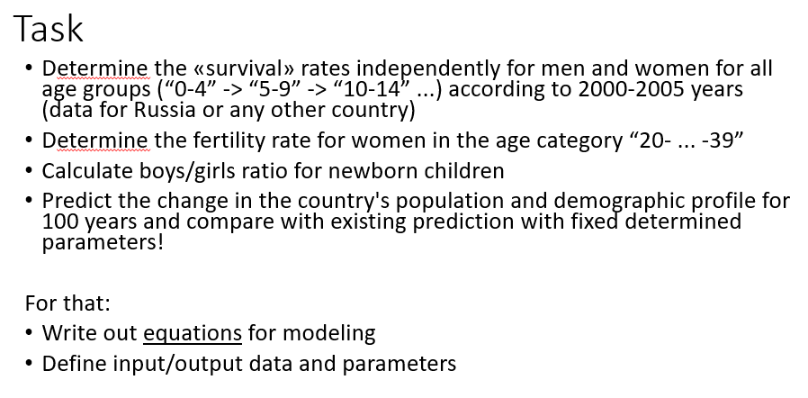

## ЛР 2

Чернышова Дана Кирилловна


1) Task description



2) Solution method (possible with code)

Survival Rates by Age Group (2000-2005)
```python
import pandas as pd
import matplotlib.pyplot as plt

male_data = pd.read_excel('age_data_2005.xls', header=5, sheet_name=3)
female_data = pd.read_excel('age_data_2005.xls', header=5, sheet_name=6)

male_russia = male_data[male_data['Country code'] == 643]
female_russia = female_data[female_data['Country code'] == 643]

# years
male_2000 = male_russia[male_russia['Reference date (as of 1 July)'] == 2000.0].iloc[:, 6:].values[0]
male_2005 = male_russia[male_russia['Reference date (as of 1 July)'] == 2005.0].iloc[:, 6:].values[0]
female_2000 = female_russia[female_russia['Reference date (as of 1 July)'] == 2000.0].iloc[:, 6:].values[0]
female_2005 = female_russia[female_russia['Reference date (as of 1 July)'] == 2005.0].iloc[:, 6:].values[0]

# calculate surv rates
age_groups = male_data.columns[6:]  # age
male_survival = male_2005[1:] / male_2000[:-1]
female_survival = female_2005[1:] / female_2000[:-1]

plt.figure(figsize=(12, 6))
plt.plot(age_groups[:-1], male_survival, 'o-', label='men')
plt.plot(age_groups[:-1], female_survival, 'o-', label='women')
plt.title('surv rates by age group (2000-2005)')
plt.xlabel('age')
plt.ylabel('survival rate')
plt.xticks(rotation=45)
plt.legend()
plt.tight_layout()
plt.show()
```

fertility rate for women in the age category “20-...-39”

```python
import pandas as pd
import matplotlib.pyplot as plt
import os

path = os.path.join(os.getcwd(), 'age_data_2005.xls')
sheets = pd.ExcelFile(path).sheet_names
total_pop_data = pd.read_excel(path, header=5, sheet_name=sheets[0])
female_pop_data = pd.read_excel(path, header=5, sheet_name=sheets[6])

country_code = 643
total_pop_data = total_pop_data[total_pop_data['Country code'] == country_code]
female_pop_data = female_pop_data[female_pop_data['Country code'] == country_code]

total_pop_data = total_pop_data.set_index('Reference date (as of 1 July)')
female_pop_data = female_pop_data.set_index('Reference date (as of 1 July)')

age_groups_20_39 = ['20 - 24', '25 - 29', '30 - 34', '35 - 39']
births_proxy = '0 - 4'
fertility_rates = pd.DataFrame(index=female_pop_data.index)

for age_group in age_groups_20_39:
	fertility_rates[age_group] = total_pop_data[births_proxy] / female_pop_data[age_group]

plt.figure(figsize=(12, 8))
for age_group in age_groups_20_39:
	plt.plot(fertility_rates.index, fertility_rates[age_group], marker='o', label=age_group)

plt.xlabel('year')
plt.ylabel('fertility rate')
plt.legend()
plt.grid(True, alpha=0.3)
plt.show()
```
boys/girls ratio for newborn children

```python
import pandas as pd
import matplotlib.pyplot as plt
import os

path = os.path.join(os.getcwd(), 'age_data_2005.xls')
sheets = pd.ExcelFile(path).sheet_names

male_data = pd.read_excel(path, header=5, sheet_name=sheets[3])
female_data = pd.read_excel(path, header=5, sheet_name=sheets[6])

country_code = 643
male_data = male_data[male_data['Country code'] == country_code]
female_data = female_data[female_data['Country code'] == country_code]

male_data = male_data.set_index('Reference date (as of 1 July)')
female_data = female_data.set_index('Reference date (as of 1 July)')

boys = male_data['0 - 4']
girls = female_data['0 - 4']

plt.figure(figsize=(12, 6))
plt.plot(boys.index, boys, 'b-', marker='o', label='boys')
plt.plot(girls.index, girls, 'r-', marker='o', label='girls')
plt.xlabel('year')
plt.ylabel('newborns')
plt.legend()
plt.show()
```
population prediction
```python
import os
import warnings
import numpy as np
import pandas as pd
import matplotlib.pyplot as plt

warnings.filterwarnings("ignore")

def load_and_preprocess_data(file_name, country_code=643):
	path = os.path.join(os.getcwd(), file_name)
	sheets = pd.ExcelFile(path).sheet_names
	
	both_1950_data = pd.read_excel(path, header=5, sheet_name=sheets[0])
	
	def filter_dataset(dataset):
		for col in dataset.columns:
			if col not in ['Index', 'Variant', 'Major area, region, country or area*',
			               'Notes', 'Country code', 'Reference date (as of 1 July)']:
				dataset[col] = pd.to_numeric(dataset[col], errors='coerce')
		
		return (dataset[dataset['Country code'] == country_code]
		        .drop(columns=['Index', 'Variant', 'Major area, region, country or area*',
		                       'Notes', 'Country code'])
		        .rename(columns={'Reference date (as of 1 July)': 'Year'})
		        .set_index('Year'))
	
	return filter_dataset(both_1950_data)

both_1950 = load_and_preprocess_data('age_data_2005.xls')
age_categories = both_1950.columns
available_years = both_1950.index.tolist()

def calculate_fertility_rate(year):
	if year not in both_1950.index:
		return np.nan
	
	women_20_39 = both_1950.loc[year, ['20 - 24', '25 - 29', '30 - 34', '35 - 39']].sum()
	if women_20_39 > 0:
		return both_1950.loc[year, '0 - 4'] / women_20_39
	return np.nan

fertility_rates = [calculate_fertility_rate(year) for year in available_years]
fertility_rates = [rate for rate in fertility_rates if not np.isnan(rate)]
fertility_rate = np.median(fertility_rates)

def project_population(start_year, projection_years=100, step=5):
	years = [start_year + i * step for i in range(projection_years // step + 1)]
	total_population = np.zeros(len(years))
	
	if start_year in both_1950.index:
		total_population[0] = both_1950.loc[start_year].sum()
	else:
		latest_year = max([year for year in available_years if year <= start_year])
		total_population[0] = both_1950.loc[latest_year].sum()
	
	for i in range(1, len(years)):
		# simplified projection -> apply overall growth factor
		total_population[i] = total_population[i - 1] * 0.99
	
	return years, total_population


start_year = 2005
proj_years, total_pop = project_population(start_year, 100, 5)

plt.figure(figsize=(10, 6))
plt.plot(proj_years, total_pop, 'b-', linewidth=2, label='projected population')
actual_years = [year for year in both_1950.index if year >= 1950]
actual_population = [both_1950.loc[year].sum() for year in actual_years]
plt.plot(actual_years, actual_population, 'r-', linewidth=2, label='hist data')
plt.xlabel('year')
plt.ylabel('population')
plt.legend()
plt.tight_layout()
plt.show()

```

3) Results

picture 1. Survival Rates by Age Group (2000-2005)


picture 2. fertility rate


picture 3. boys/girls ratio for newborn children


picture 4. population prediction

